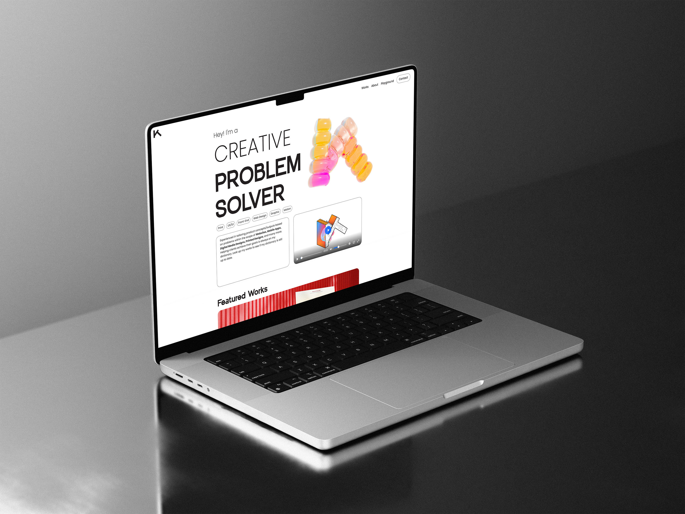

# Keith Richard Lie Portfolio 2024

## The development on Keith's Website Portfolio

This repo is used to create Keith's Web Portfolio. I plan to brand myself as a Creative Problem Solver / Designer, specializing in Product Design (UX/UI, Website, Mobile, etc.) yet still showcases my Graphic/Motion Design skills within the portfolio.

## My main pages will include:
[Home](#home) 
[Works](#works) 
[About](#about) 
[Playground](#playground) 

## Home 🏠 
The homepage will showcase my demo reel motion video that I made with love! Also 3 of my featured works that I think the best I've done so far. More to come!

## Works 💻 
Now this page will contain all of my works. All of it going to be a high-quality case studies that will interest you personally! Try having a look at some of it and I guarantee you that you guys will like them.

## About 😁 
Now this page is all about me. Inside there will be a resume-like page that summarize my experiences, skills, and hobbies. Get to know me more as a person on my page! Also as a professional creative problem solver.

## Playground 🏖 
This page is where I did things other than my big works. Some freelances or even hobbies are in this page. There will be illustrations, motion graphics, drawings, graphic designs, etc. Come have a look!

## Languages I used 📒
- HTML5
- CSS3
- Javascript
- Greensock Animation
- PHP
- MySQL

## Installation 💾
To run the portfolio locally:

1. Clone this repository
2. Head to the index.html
3. Double click it or open it on whichever browser you want! It's responsive.

## Contact 📞
Since the portfolio is not live for now, feel free to reach out to me through these:
- LinkedIn: [Keith Richard](https://www.linkedin.com/in/keith-richard-79b312183/)

## History

Created 07/10/2024

## Credits

Created by Keith Lie

## License

MIT - See license file for more information
